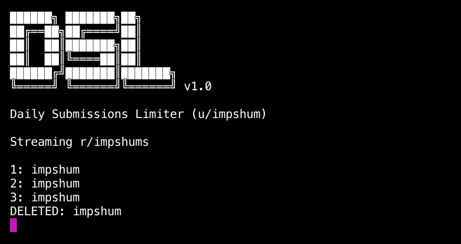

## Daily Submissions Limiter

Allows only 3 submissions per day per user on a chosen subreddit.



### Instructions

- Install requirements ```pip install -r requirements.txt```
- Create Reddit (script) app at https://www.reddit.com/prefs/apps/ and get your id, tokens etc
- Edit conf.ini with all your juicy details
- Run it ```python3 run.py```

